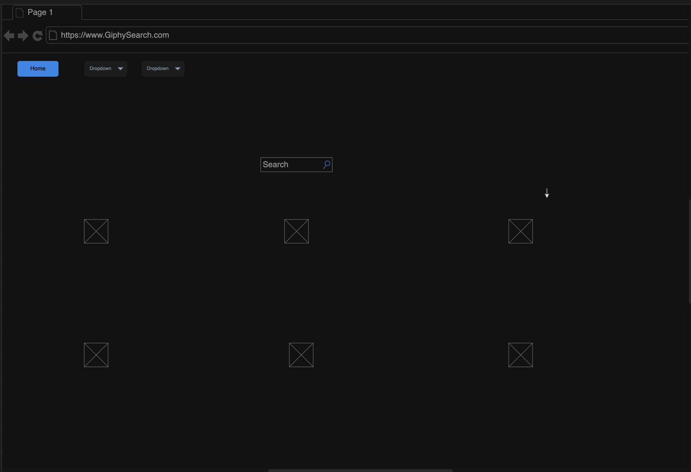
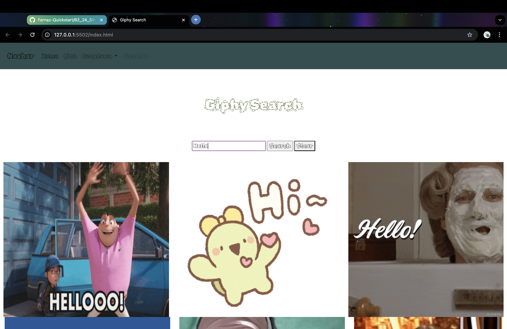

# Martin Ramirez

# Simple-Search-Engine Description

A simple-search website to enjoy viewing Gifs.

Users can interact with the website by searching any word they want. Gifs will automatically be generated for entertainment.

# WireFrames

# Technologies Used
1. HTML
2. CSS
3. JavaScript
4. Google Fonts
5. Bootstrap

# User Stories 
1. As a user, I want to view gifs based on what I search. 
2. As a user, Once I am finished it should be possible to clear what I searched.
3. As a user, I would like to generate popular gifs by clicking a "Trending" button.

# Screenshots

# Future Improvements
1. I would like to write cleaner code.
2. Want a better understanding of JavaScript.
3. Learn multiple ways of using DOM and JavaScript.
